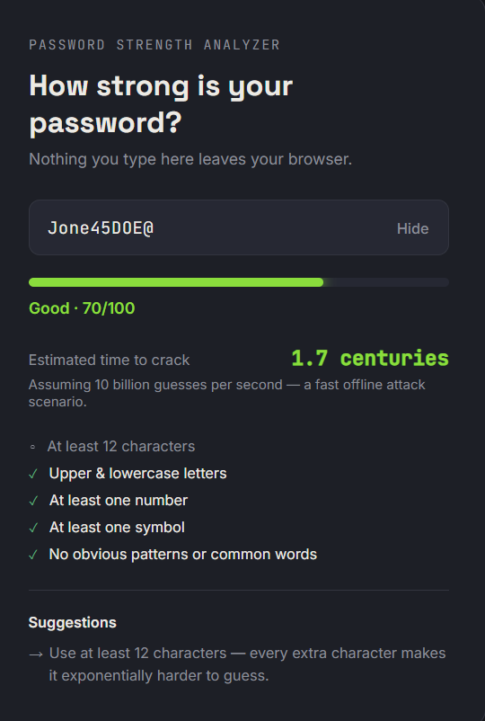

# Password Strength Analyzer

A small web app that checks how strong a password is while you type — no server, no tracking, everything happens right in your browser.

I built this as a beginner project to practice vanilla JavaScript, DOM manipulation, and get more comfortable with git and GitHub.

## What it does

- Scores a password out of 100 based on length, character variety, and weak patterns
- Estimates how long it would take to brute-force, assuming a fast offline attack (10 billion guesses/sec)
- Flags it if it's one of the most commonly used/leaked passwords
- Gives specific suggestions for improving it ("add a symbol," "avoid keyboard sequences," etc.)
- Live strength meter that smoothly shifts color as you type, instead of jumping between fixed colors

## Try it live

[Add your GitHub Pages link here once it's set up — e.g. https://chanidu321.github.io/password-strength-analyzer]

## Screenshot

(Add a screenshot here once you've taken one — see the note at the bottom of this file.)

## Running it locally

```
git clone https://github.com/chanidu321/password-strength-analyzer.git
```

Then just open `index.html` in your browser. No build step, no dependencies, no npm install. If you're using VS Code, the Live Server extension is the easiest way to run it with auto-reload.

## How it's organized

- `index.html` — page structure
- `style.css` — all the visual styling, including the animated meter
- `script.js` — the actual analysis logic: scoring, the crack-time estimate, and the suggestions

The scoring isn't based on any official standard, it's a rubric I wrote myself: points for length and character variety, penalties for repeated characters, keyboard sequences, and matches against a small list of common passwords.

## What I'd add next

- Check against a real breached-password list (like the HaveIBeenPwned API) instead of a small hardcoded array
- A password generator
- A light/dark theme toggle

## A note on privacy

Nothing typed into this app is sent anywhere. The whole thing runs client-side in the browser — that's the whole point of doing it this way instead of with a backend.

---

**To add a screenshot:** take a screenshot of the app running, save it in this folder as `screenshot.png`, then replace the "Screenshot" section above with:

```

```
